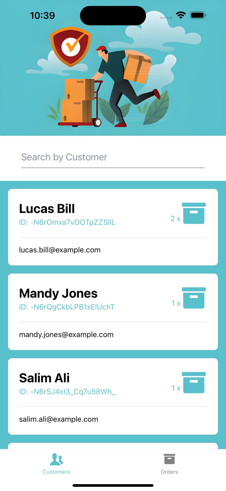
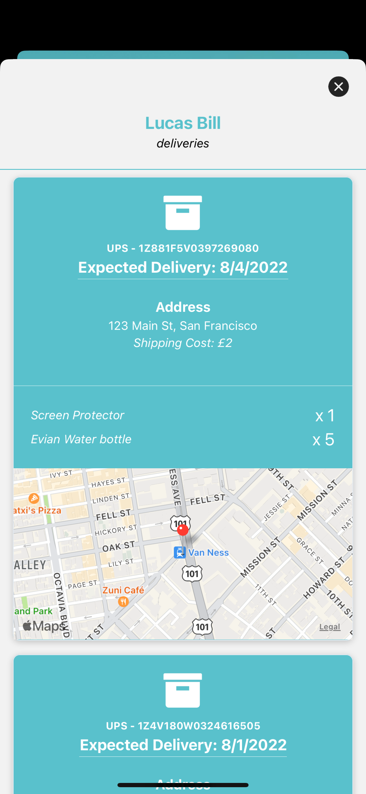
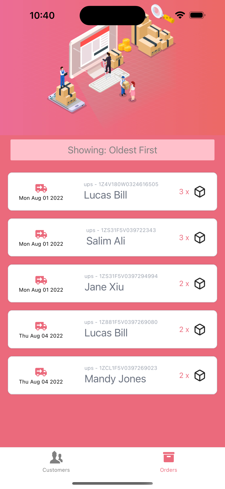
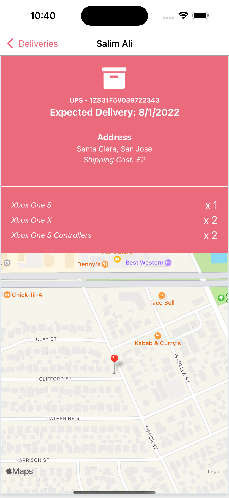

# UPS Clone App - React Native

This is a UPS clone made with React Native, following Sonny Sangha's tutorial on [YouTube](https://www.youtube.com/watch?v=hvvWv2GLWss&t=10853s) Check his video if you want to learn more.

## Final Project:

Below are some screenshots of the final App built during the tutorial:

    
    
     
    
    

